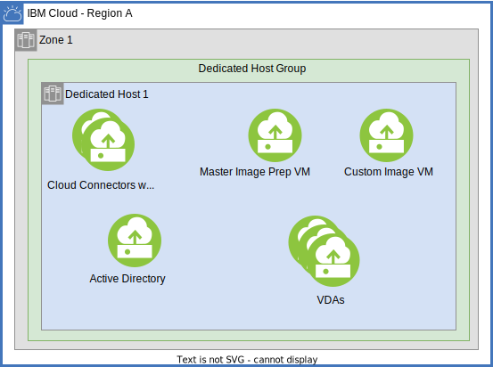
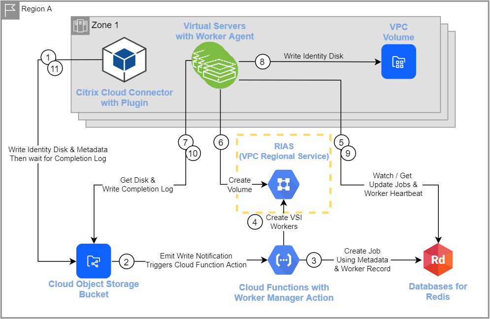

---

copyright:
  years: 2020, 2022
lastupdated: "2022-08-26"

keywords:

subcollection: citrix-daas

---

{:shortdesc: .shortdesc}
{:codeblock: .codeblock}
{:screen: .screen}
{:external: target="_blank" .external}
{:pre: .pre}
{:tip: .tip}
{:beta: .beta}
{:important: .important}
{:table: .aria-labeledby="caption"}
{: deprecated: .deprecated} 

# About {{site.data.keyword.cvad_full_notm}} 
{: #about-citrix-virtual-apps-and-desktops}

{{site.data.keyword.cvad_full}} is a streamlined process for experienced administrators and service providers to create a dedicated {{site.data.keyword.cvad_short}} service environment at one of our global data centers. This solution provides flexibility, control, and saves you time in building out your virtual apps and desktops solution. If you are invested in virtual desktop infrastructure (VDI), you understand the complexity of hosting and managing VDI entirely on-premises. The offering is purposefully built for a better VDI experience in the cloud.

The solution is integrated with the {{site.data.keyword.cvad_short}} service deployment model, which shifts the management of core components to Citrix so you can focus on managing your applications and desktops. {{site.data.keyword.cloud_notm}} creates the Citrix Cloud Connectors and other compute, networking, and storage components that are required to host your applications and desktops and connects the {{site.data.keyword.cloud_notm}} resource location to Citrix Cloud. You manage the infrastructure components after provisioning, including the Active Directory and Virtual Delivery Agents (VDAs).

## Provisioning {{site.data.keyword.cvad_short}} on Classic Infrastructure option
{: #citrix-daas-classic-provisioning-options}

{{site.data.keyword.cvad_full}} Classic automation is deprecated. As of 12-4-23, you can't create new classic instances with automation. 
{: deprecated}

 You can provision Citrix Hypervisor on Bare Metal servers or VMware. For more information about provisioning on Classic infrastructure, see [Provisioning {{site.data.keyword.cvad_short}} on {{site.data.keyword.cloud_notm}} Classic infrastructure](/docs/cvad?topic=citrix-daas-provisioning-cvad-classic).
 

{: caption="Figure 1. {{site.data.keyword.cvad_full_notm}} Classic architecture diagram" caption-side="bottom"}

## Provisioning {{site.data.keyword.cvad_short}} on Virtual Private Cloud option
{: #citrix-daas-vpc-provisioning-options}

You can provision {{site.data.keyword.cvad_short}} on Virtual Private Cloud. For more information about provisioning on Virtual Private Cloud infrastructure, see [Provisioning {{site.data.keyword.cvad_full_notm}} on Virtual Private Cloud](/docs/citrix-daas?topic=citrix-daas-provisioning-citrix-daas-vpc).

{: caption="Figure 2. {{site.data.keyword.citrix-daas_full_notm}} VPC architecture diagram" caption-side="bottom"}

### Dedicated Host Control Plane
{: #citrix-daas-vpc-dedicated-hosts-arch}

The standard dedicated host option for {{site.data.keyword.cvad_short}} on VPC provisions the control plane components (active directory, cloud connectors, and custom image VSI) onto public hosts and the VDAs to the dedicated hosts.

{: caption="Figure 3. Dedicated Host standard deployment" caption-side="bottom"}

With the shared dedicated option, the control plane is also provisioned to the dedicated hosts.

{: caption="Figure 4. Dedicated Host shared deployment" caption-side="bottom"}

### Volume Worker 
{: #citrix-daas-vpc-volume-worker-arch}

Volume Worker distributes the work of the Citrix identity disk creation.
The volume worker consists of 4 components:
* A Cloud Object Storage bucket, used to store the jobs, (data) identity disks, and the completion logs. Work is added to the Cloud Object Storage bucket in the form of JSON metadata. 
* The volume worker manager, used to creating the job in the database and creating an appropriate number of worker VSIs to complete the jobs. The volume manager is an IBM Cloud Function Action.
* VSIs with the volume worker agent, used to claim work in the database, create, and write the volume, and then log the result into the Cloud Object Storage bucket. 
* A Redis database. 

This diagram shows the order of operations in volume worker:

{: caption="Figure 5. Volume Worker flow" caption-side="bottom"}

The operation order that is shown in the diagram is:

1.  The cloud connector plug-in writes job metadata and identity disk data to the Cloud Object Storage bucket.
2.  IBM Cloud Functions is triggered by notification.
    1.   The Cloud Object Storage service emits a write notification that is used by IBM Cloud Functions.
    2.  A trigger is fired for that notification that starts the volume worker manager action.
3.  Volume worker manager creates the job in redis.
4.  Volume worker manager creates volume worker VSIs if needed.
5.  Volume worker agent watches job queue, gets, and claims job.
    *  Volume worker agent updates TTL for worker data as it watches queue (heartbeat).
6.  Volume worker agent creates VPC Volume from metadata.
7.  Volume worker agent retrieves the identity disk from Cloud Object Storage bucket.
8.  Volume worker agent writes the identity disk to the new VPC Volume.
9.  Volume worker agent updates the job in redis.
10. Volume worker agent writes a completion log to Cloud Object Storage bucket.
11. Cloud connector plug-in waits for completion log.

### Volume Worker and Logging
{: #citrix-daas-vpc-volume-worker-logging}

Some PaaS services are not available in all regions. The volume worker manager runs in {{site.data.keyword.openwhisk}} which is not available in br-sao, ca-tor, or jp-osa. To provide the volume worker in the br-sao, ca-tor, or jp-osa regions, the volume worker manager is deployed in an {{site.data.keyword.openwhisk_short}} instance residing in a nearby region:

* For br-sao and ca-tor, us-east is used. 
* For jp-osa, jp-tok is used. 

Where the volume worker manager is deployed affects logging for those deployments. In order to receive the volume worker manager logs in these regions, the customer must configure a {{site.data.keyword.la_full}} instance in us-east for br-sao and ca-tor Citrix DaaS deployments and in jp-tok for a deployment in jp-osa. 

## Related information
{: #citrix-daas-related-info}

For more information about the {{site.data.keyword.cvad_short}} service, see [Citrix documentation](https://docs.citrix.com/en-us/citrix-virtual-apps-desktops-service){: external}.
