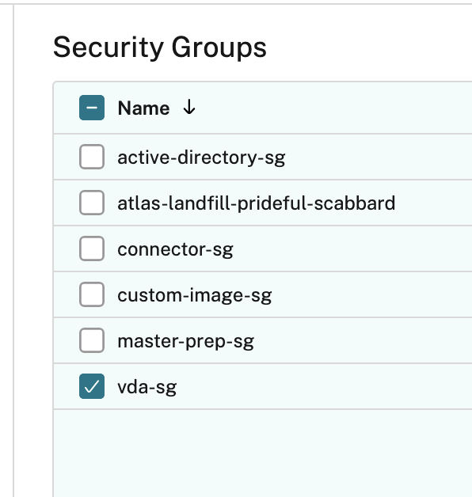

---

copyright:
  years: 2022, 2024
lastupdated: "2024-03-22"

keywords:

subcollection: citrix-daas

---

{:shortdesc: .shortdesc}
{:codeblock: .codeblock}
{:screen: .screen}
{:new_window: target="_blank"}
{:pre: .pre}
{:tip: .tip}
{:beta: .beta}
{:deprecated: .deprecated}
{:table: .aria-labeledby="caption"}

# Troubleshooting {{site.data.keyword.cvad_full_notm}} VPC
{: #cvad-troubleshooting-vpc}

{{site.data.keyword.cvad_full}} is deprecated. As of 18 April 2024, you can't create new instances, and access to existing instances will be removed. Existing premium plan instances are supported until 18 April 2024. Any instances that still exist on that date will be deleted. 
{: deprecated}

Use this information when troubleshooting {{site.data.keyword.cvad_full}} on VPC.

## The VDA is not registering
{: #troubleshooting-vda-not-registering}

When you create a Machine Catalog, the VDA shows as Unregistered. This error happens because the VDA security group was not selected when the Machine Catalog was created. The create defaults to the first security group in the list, you must select the VDA security group instead of using the default.  

{: caption="Figure 1. Machine Catalog VDA Security Group" caption-side="bottom"}

Either modify the existing Machine Catalog to use the VDA security group or create a new Machine Catalog and specify the VDA security group.

## Profile with instance storage error
{: #troubleshooting-instance-storage}

In the Schematics window, during the Terraform Apply, you see an error that is similar to this message:

```
022/02/24 22:25:59 Terraform apply | Error: users are restricted from accessing generic profiles with instance storage
 2022/02/24 22:25:59 Terraform apply | 
 2022/02/24 22:25:59 Terraform apply |   with ibm_is_instance.custom_image_instance[0],
 2022/02/24 22:25:59 Terraform apply |   on main.tf line 335, in resource "ibm_is_instance" "custom_image_instance":
 2022/02/24 22:25:59 Terraform apply |  335: resource "ibm_is_instance" "custom_image_instance" {
 2022/02/24 22:25:59 Terraform apply | 
 2022/02/24 22:25:59 [1m[31mTerraform APPLY error: Terraform APPLY errorexit status 1[39m[0m
 ```
 {: codeblock}

 When the solution was provisioned, a profile with instance storage was selected. However, instance storage is not supported for VPC. Instance storage profiles have a 'd' in the profile name, for example 'cx2d-2x4' is a compute profile that has instance storage, 'cx2-2x4' is a compute profile that does not have instance storage. 
 
 Either edit the profile and remove the 'd' or enter a new profile. For more information on available instance profiles, see [Instance profiles](/docs/vpc?topic=vpc-profiles&interface=ui).

## Cloud connector is not registering
{: #troubleshooting-vpc-cc-not-registered}

During post-provisioning, you access the [Cloud Connector instance](/docs/citrix-daas?topic=citrix-daas-post-provisioning-cvad-vpc#access-ad-connectors-vpc). If the Cloud Connector is not registering, in can be one of two problems. The messages are logged in the Cloud Connector log file on Citrix. 

Create a floating ip to use Remote Desktop to get to the cloud connector log file on Citrix cloud. The file is `C:\ProgramData\IBMCitrixDaaS\Logs\IBMCitrixDaaSInstallation.log`. Close to the end of the log file is either a:
* 1603 error 
* ResourceLocationId error 

If the error is 1603, contact Citrix support. 

If the error is ResourceLocationId, an invalid resource location was used during provisioning, for example, the Resource location might have been removed or a limit was reached. To resolve this error, try one of the following actions:
1.  Use Schematics to destroy the resources and rerun the Apply from the Settings page. 
2.  Use Schematics to destroy the resources and rerun the Apply from the Settings page and remove the workspace. Reprovision the {{site.data.keyword.cvad_short}} solution with a valid resource location. 
3. Contact IBM support. 

## Authentication error
{: #troubleshooting-vpc-permissions}

During the Apply, you get an authentication error. Check to make sure you have the right permissions for using Schematics. For more information about the permission needed, see [Getting Started](/docs/citrix-daas?topic=citrix-daas-getting-started-tutorial#set-up-user-permissions)

## Machine Catalog Snapshot error 
{: #troubleshooting-snapshot}

When you are creating the Machine Catalog and you receive an error that mentions snapshots. Re-create the Machine Catalog. 

## After multiple apply attempts for Volume Worker, Schematics shows an IBM Cloud Functions error
{: #troubleshooting-functions}

After selecting **Apply Plan** more than once, you get an error similar to this:

```
2022/07/19 14:23:30 Terraform apply | Error: [ERROR] Error creating IBM Cloud Function Action: The request content was malformed:
 2022/07/19 14:23:30 Terraform apply | 'kind' must be a string defined in 'exec' (code 2992d8a65102f19991000a2c66a52b18)
 2022/07/19 14:23:30 Terraform apply | 
 2022/07/19 14:23:30 Terraform apply |   with module.volume_worker[0].module.manager.ibm_function_action.manager,
 2022/07/19 14:23:30 Terraform apply |   on modules/fortio/modules/manager/main.tf line 44, in resource "ibm_function_action" "manager":
 2022/07/19 14:23:30 Terraform apply |   44: resource "ibm_function_action" "manager" {
 2022/07/19 14:23:30 Terraform apply | 
 2022/07/19 14:23:30 [1m[31mTerraform APPLY error: Terraform APPLY errorexit status 1[39m[0m
 2022/07/19 14:23:30 [1m[31mCould not execute job: Error : Terraform APPLY errorexit status 1[39m[0m
 ```

This error occurs because the workspace is reset each time an apply is tried and the local file for the manager is sent to IBM Functions.  

Destroy your resources and **Apply Plan** again.
